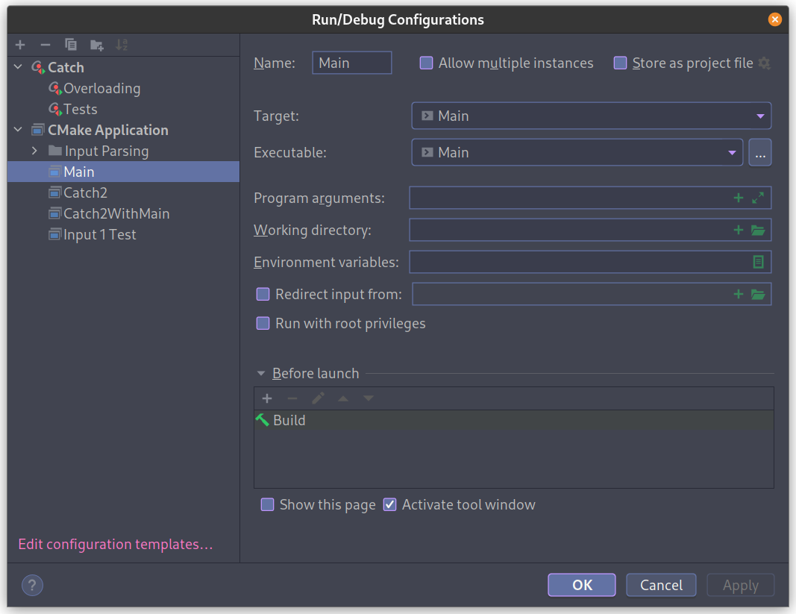
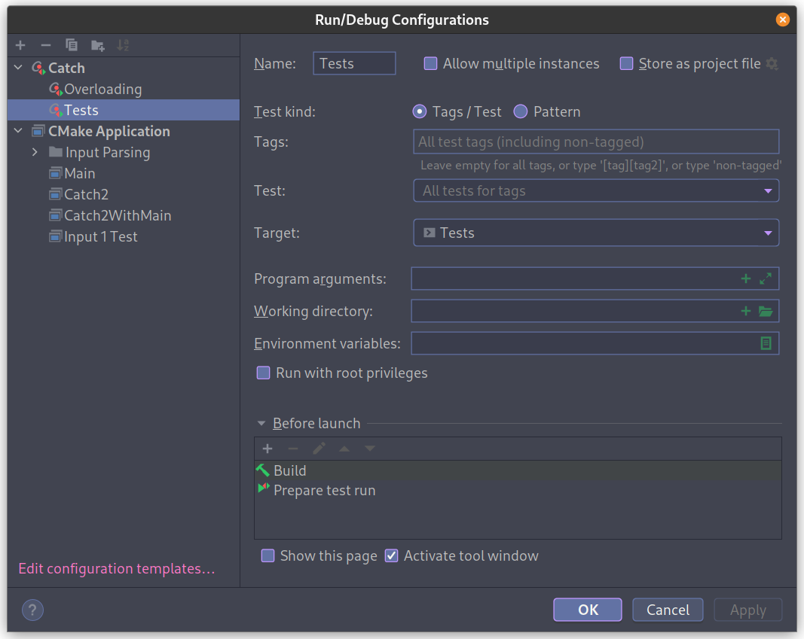
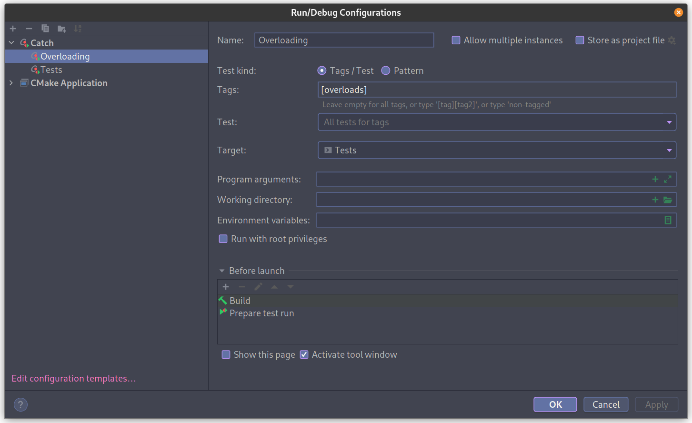
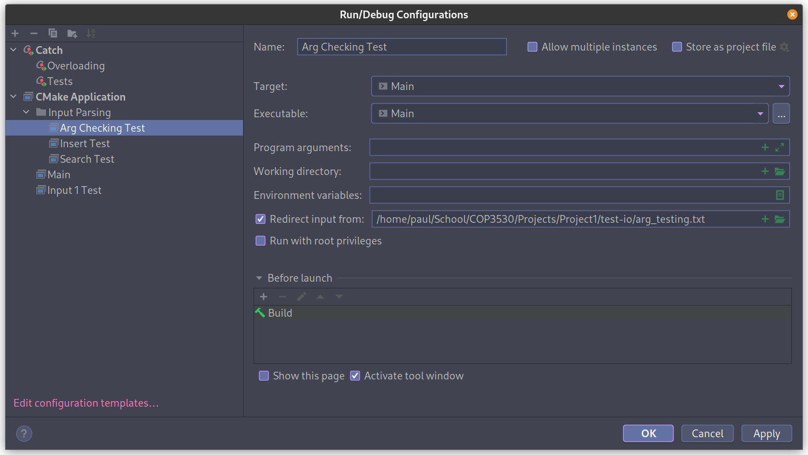
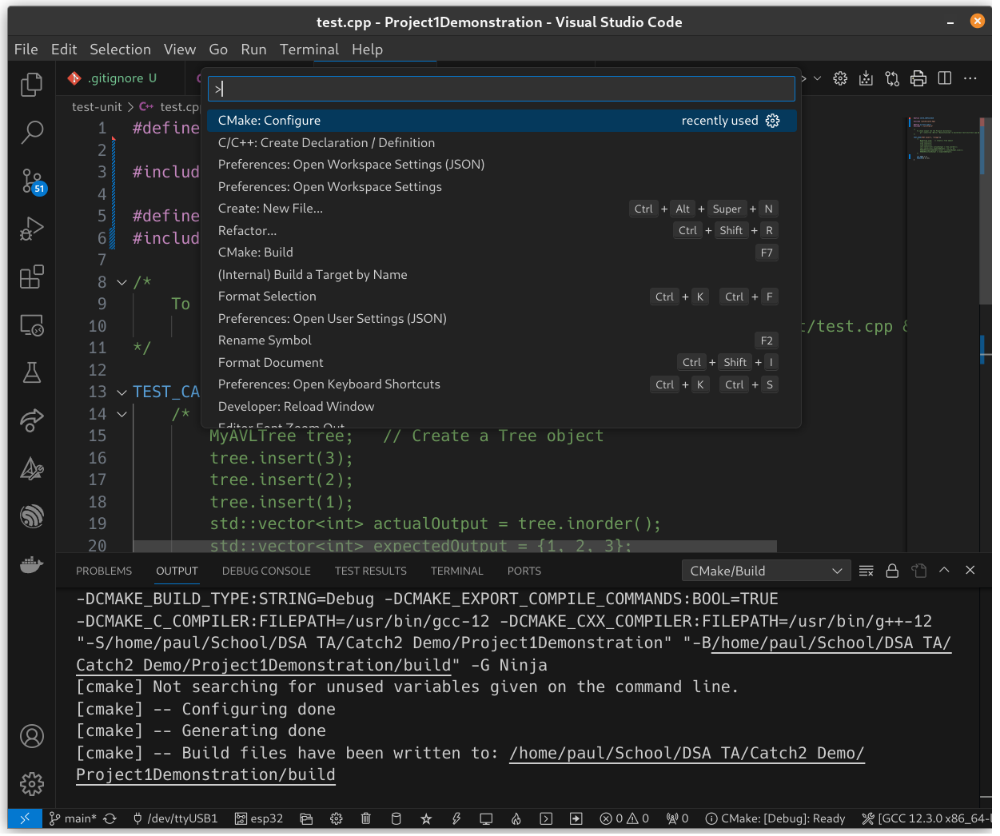
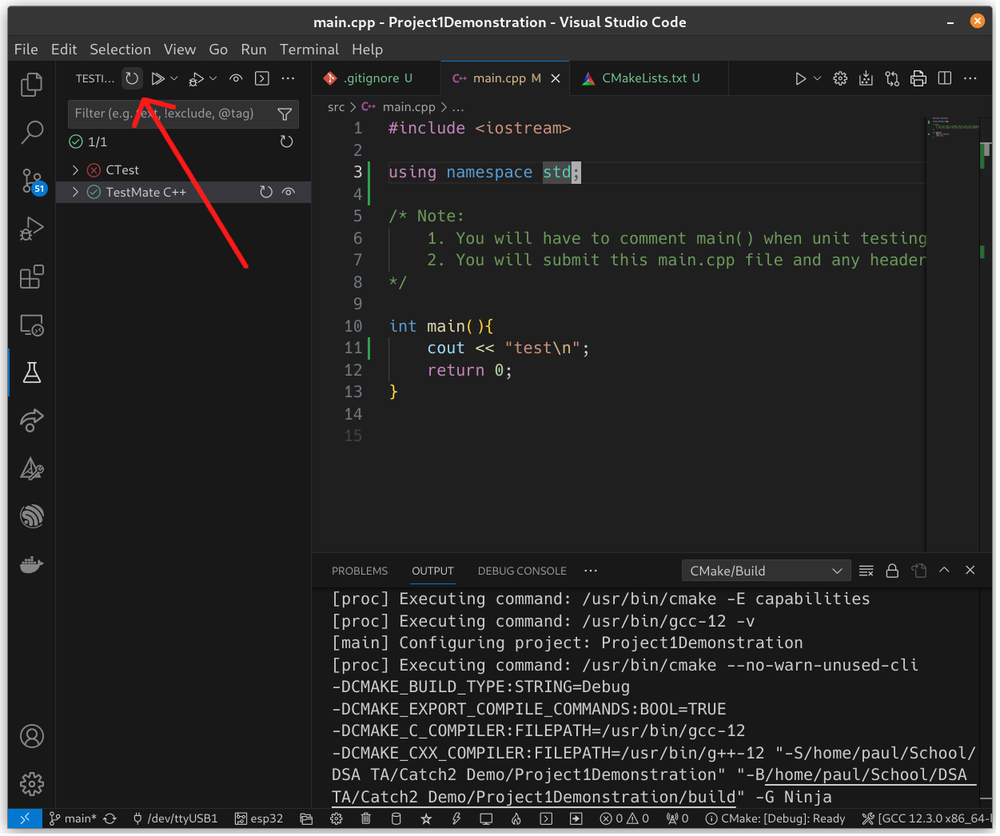
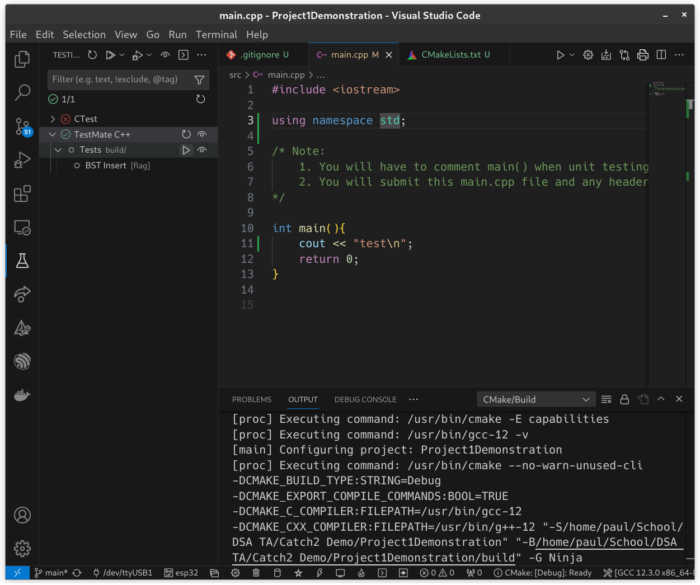
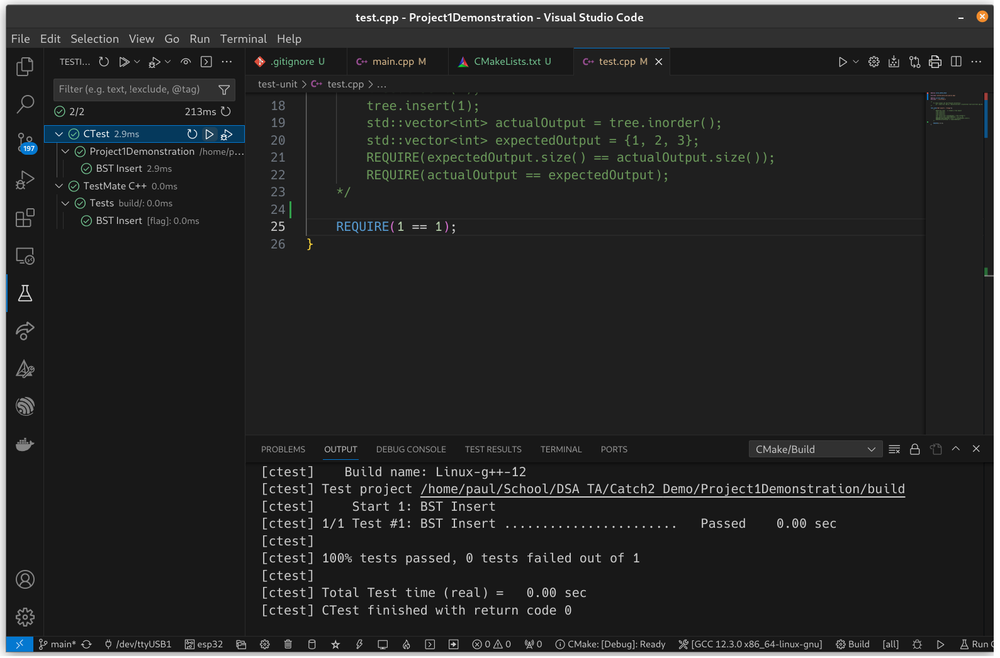

This is a guide to use catch with cmake instead of the header file approach provided by Edugator. It was originally written for use with the University of Florida's COP3530 class but should work under any circumstances.

A [video version of this guide](https://youtu.be/DqE3UpOdBLw?si=rM44usul4MM0pDC6) is available.

**Note**:I use CLion, so the first part of this guide pulls screenshots from that interface. A VSCode addendum is provided at the bottom of the file with an additional tutorial video for getting set up - your CMakeLists.txt file and test.cpp should look the same, regardless of the IDE that you are using.

# Part 0: Why Bother?

Using the included catch file works fine, but each time you change test.cpp, it recompiles the entire catch header, making it take quite a while. Additionally, the catch.hpp provided on the project template is old and doesn&rsquo;t actually compile on Linux without adding the line `#define CATCH_CONFIG_NO_POSIX_SIGNALS` (<https://github.com/catchorg/Catch2/issues/2421>).

By instead using catch&rsquo;s newer cmake integration, it builds way quicker, lets you have a separate unit testing executable and main executable, and gives you access to the latest features of catch should you need them.

<a id="orgf5c7f84"></a>

# Part 1: Put your project on git/Github *now*
As a side-effect of pulling catch2 in as a Git repository, CLion will think your project is actually Catch2 and not whatever you're working on. It's easiest to address this beforehand and get your version control workflow set up with CLion so that you don't run into issues after the fact.

I find it easiest to click the "Version control" tab and then "Share Project On" to have pushes to my Github automatically set up, but feel free to do whatever is most comfortable for you.

# Part 1.5 (Optional, but helpful): Update CLion
Older versions of CLion can have issues with newer versions of Catch2. Updating now might save you some headache later. If you installed CLion recently or you know you're already up to date, you can skip this part. 

If you end up running into esoteric issues, this should be the first thing that you try. Other potential issues are described in the FAQ at the bottom of the document.

# Part 2: Setting up cmake
This is mostly the same as from the video tutorial on each programming quiz (if you&rsquo;re using clion): navigate to test.cpp, click create a CMakeLists.txt, and accept the options to get a default file. From there, you need to add a couple lines to first pull in catch2 as a dependency and then link it to your compiled Tests executable. It&rsquo;s easier to show than to tell, so I&rsquo;ve attached a commented [CMakeLists.txt](./CMakeLists.txt) to explain.

Note that the CMakeLists.txt that is created by default doesn't include an executable for your Main without debug stuff by default. To create it, simply copy your Project1 or Tests `executable_add` block and replace test.cpp with main.cpp. catch.hpp is provided with the Project1 template and is by default included in the add_executable line for your default build. Be sure to remove any reference to catch.hpp in your CMakeLists.txt to actually use the faster Catch2 setup. The easiest way to do this would probably be to delete the catch.hpp file through Clion, which would then (hopefully) remove references to it elsewhere. Otherwise, you can just delete it yourself.


# Part 2.5: Changing the include in test.cpp
I forgot to include this when originally writing the guide, but it's an important step. First, make sure you don't have your `main.cpp` included in `test.cpp`. Additionally, you need to replace the original `#include "catch.h"` with `#include <catch2/catch_test_macros.hpp>` for it to actually use the cmake-based catch.
The top of my test.cpp looks like this:
```c++
#define CATCH_CONFIG_MAIN

#include <catch2/catch_test_macros.hpp>
#include <iostream>
#include "../src/AVL.h"
#include "../src/Parser.h"
#include "../src/StudentNode.h"
```

Keep in mind that you should include your own header files.


<a id="org390eeee"></a>

# Part 3: Integrating with clion

I think Clion should do this automatically, but just in case, here&rsquo;s some screenshots of the different setups for the main executable and the unit test executable.





Once the two default builds are set up, I find it easiest to test specific things by duplicating the base configurations and changing flags. For example, to test the `[overloads]` catch flag only:


You can also pass in certain files as stdin so you don&rsquo;t have to type test inputs manually:

Note that this can be done with the provided files as well as custom ones you write.

# Part 3 Alternate: Integrating with VSCode
Everything in the guide about the CMakeLists.txt file and test.cpp holds - the only difference with VSCode is how test running is integrated into the editor. You can also run a newer version of Catch2 if you want.

Here is a [video guide](https://youtu.be/yj8baGjXmTU) by TA Brian, although note that it doesn't use Project 1 as the example - you can modify the CMakeLists.txt provided by this repository in your own project. If you're interested in knowing why the CMakeLists.txt is set up like it is, you can watch the first part of the CLion-based video.

The text below is a writeup of the extra details from said video to get Catch2 set up with VSCode.

Note that this method will only work for code that is locally hosted on your computer such that git can "verify ownership" - you might run into problems if you store your code on a flash drive or a OneDrive folder, for instance.

## Extensions and Installations
Make sure that you have the following extensions installed on your VSCode.

- C/C++ (Microsoft)
- C/C++ Extension Pack (Microsoft)
- C++ TestMate (Mate Pek)
- CMake Tools (Microsoft)
- CMake Language Support (either twxs or Jose Torres)

You must also install CMake itself to your system. CLion bundles a version of CMake with itself so this step is unnecessary if on CLion. Note that the version you install may be older that what CLion would package - if you get an error in your CMakeLists.txt about your CMake being too old, simply change this line

``` cmake
cmake_minimum_required(VERSION 3.24)
```

to have whichever version of CMake that you have installed.

## Running and Compiling Tests
Once your CMakeLists.txt and test.cpp are in place, run the command `CMake: Configure` in the VSCode command palette to set CMake up.



Once this has run, you should be able to open the testing panel on the side of the window and see the name of your project. Click the "Refresh tests" button to reload your tests.




From here, you should be able to click on the drop down for TestMate C++ and then another for whatever you named your test executable in CMakeLists.txt. Click the play button to run the tests.




Note that each time you update your tests, you will have to click the "Refresh tests" button again for the changes to register. To get around this, you can add the following to the bottom of your CMakeLists.txt file:

```cmake
include(CTest)
include(Catch)
catch_discover_tests(Tests) # must be named the same as your test executable
```

Once you run "Cmake: Configure" again, CTests will be registered as well - now, you can click the play button next to its entry in the testing window and it will automatically rebuild your tests before running them.



# Part 4: Using it
At this point, everything should work! You can just pick your run configuration in the menu at the top, and it'll compile and run your main or Tests or any of your debug configurations.

I hope this helps!

# Addendum
The link to the Catch2 documentation for setting this up is [here](https://github.com/catchorg/Catch2/blob/devel/docs/cmake-integration.md). It goes into more detail, but was a bit hard for me to parse at first, which was one of the reasons I wrote this guide.

# FAQ:

## The provided CMakeLists.txt isn't working for me. How do I fix this?

This could be for any number of reasons. In case you haven't watched it, the first part of the CLion video goes over how each part of the CMakeLists.txt file works and some common pitfalls that you might run into. Having a better conceptual understanding of the file might be enough to fix your issue. Otherwise, common issues and their fixes are below.

- `Cannot specify link libraries for target "[Some target]" which is not built by this project`

  This error says that CMake can't find the project you're trying to link to and usually happens on the line with `target_link_libraries`. This is most likely due to a name mismatch between the name of your testing executable (the one that includes `test-unit/test.cpp`) and the name in the parentheses for `target_link_libraries`. Check both of these and make sure the names match.

- `Cannot find source file: [Some source file]`
  
  This is either due to you having a source file in one of your `add_executable` blocks that doesn't actually exist (or having a typo in its name/path), *or* 
  
  this will happen if your CMakeLists.txt is not in the root directory of your project, as the paths passed to it will not resolve properly. 
  
  You can fix this by renaming any problem files and/or moving CMakeLists.txt if it's in the wrong place.
  
- ```
  variable 'reporterIdx' set but not used [-Werror,-Wunused-but-set-variable]
              std::size_t reporterIdx = 0;
                          ^
  1 error generated.
  ```

  This error appears due to the compiler flags set in CMakeLists.txt:
  
  ```cmake
  SET(GCC_COVERAGE_COMPILE_FLAGS "-WALL -WERROR")
  SET(CMAKE_CXX_FLAGS "${CMAKE_CXX_FLAGS} ${GCC_COVERAGE_COMPILE_FLAGS}" )
  ```

  Depending on your compiler, it may also throw an error and halt compilation for unused variables in *Catch itself*, not just your own code, which is where this unused variable comes from. There are a couple ways around this:
  
  1. Specify a newer version of Catch2 in your `FetchContent_Declare` block.
     
     Catch2 3.4.0 has been reported working by students who've faced this issue - this version of Catch doesn't seem to cause the [CLion bug](https://youtrack.jetbrains.com/issue/CPP-31284) that I thought I ran into when testing this method, so it should work for both IDE's. However, if you do run into that issue, try incrementally lowering the version number until it resolves.
     
  2. Remove the compiler flags from CMakeLists.txt.
  
     This will stop your compiler from treating warnings like errors, but will make it so that your local environment's build process differs from that of Gradescope. If you leave things like unused variables in your code and try uploading to Gradescope later, you may have to fix those instances before being able to see test results.

- `multiple definition of "someFunction()"`
  
  If you have source files listed multiple times in the `add_executable()` blocks, you might get this error because the compiler expects only a single definition of each function/class. You can fix this by removing the duplicates.

## Other Errors
- `Test framework quit unexpectedly`
  This is likely due to the CLion bug I mentioned in the video, where newer versions of Catch break CLion's testing setup. First try updating your CLion to see if it resolves the issue. If that doesn't work, try lowering the version of Catch2 in your CMakeLists.txt - `v3.0.1` doesn't seem to have this issue, but depending on your compiler, you may run into issues with unused variables in Catch. Depending on your environment's setup, you may have to perform other mitigations to get everything to work.
  
- ```console
  error: 'something' redeclared with different access
    457 |       struct something
        |       ^~~~~~
  ninja: build stopped: subcommand failed.
  ```
  
  Depending on what system libraries you used in your code and what version they were, you may run into an error like this after using `#define private public` in your test.cpp. This is due to the system libraries not explicitly declaring access for class members, meaning that when `private` gets replaced with `public` in your test.cpp, there ends up being a conflict if a member is declared twice and it was implicitly defined the first time.

  There are a few ways to solve this:
  1. `#include` the problem system header in your test.cpp *before* you `#define private public` - since system headers use header guards like `#pragma once`, it won't cause errors if it's included multiple times. In this way, the header will be included with the proper access modifiers, and the second `#include` affected by `#define private public` within your header file will be ignored.
  2. Define a DEBUGGING flag in your test.cpp and then use an ifdef in your header file(s) affected by the issue so that system headers aren't impacted and the redefinition only happens when building test.cpp. It would look something like this:
  
     ```cpp
     //test.cpp
     
     #include <catch2/catch_test_macros.hpp>
     
     #define DEBUGGING
     
     #include "MyClass.h"
     
     ...
     ```
     
     ```cpp
     //MyClass.h
     
     #include <some_stdlib_class>
     
     #include "MyOtherClass.h"
     
     #ifdef DEBUGGING
     #define private public
     #endif
     
     ...
     ```
     
  3. Make the function you're trying to test public instead of private. Note that this may result in poor encapsulation points taken off if you end up doing this for a lot of internal class methods.
  
- My tests aren't running! The tests terminate or never complete.
  This can be for a variety of reasons. potential solutions are listed below.
  
  1. Update your CLion.
  
     Older versions of CLion have issues with Catch versions greater than v3.0.1 - if there's an update available for your editor, update it before trying anything else. [Jetbrains Toolbox](https://www.jetbrains.com/toolbox-app/) is a useful tool for keeping your editors up to date
     
  2. Lower the version of catch2 that you're using.
  
     If your CLion is as recent as possible and you're still having issues, you could try lowering catch to v3.0.1 in your CMakeLists.txt file to get around CLion bugs.
     
  3. Make sure you're actually using your Tests run configuration!
  
     At the top of the CLion window is a dropdown box to select which run configuration you want to use. Make sure it's set to Tests and not Main or Project1. You can see examples of working configurations in section 3 of the written tutorial.
